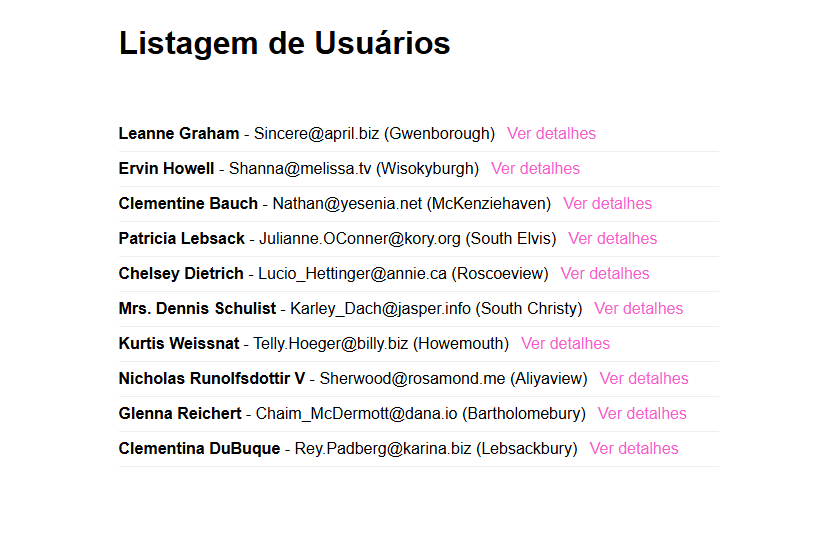
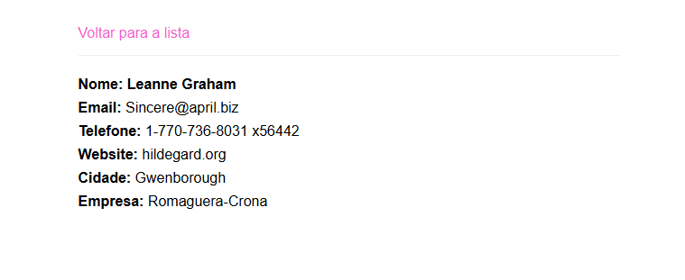

imagem 1

imagem 2

1) O que é uma rota dinâmica?
Ela é uma rota que possui diferentes parâmetro na url. Por exemplo a rota que adicionei no código: 
    {
        path: 'users/:id',
        component: UserDetail
    }
Ela é dinâmica pois cada usuário possui um ID e ele vai abrir de acordo com o usuário escolhido, mostrando a página do UserDetail mas, com as informações correspondentes.

2) O que é paramMap?
É a forma como o angular usa para acessar os valores que vem da url de uma rota dinâmica, permitindo capturar os valores da rota. Por exemplo a maneira que adicionei no código:
  ngOnInit(): void {
    this.route.paramMap.subscribe(params => {
      const id = Number(params.get('id'));

      if (id) {
        this.buscarUsuario(id);
      } else {
        this.erro = "id inválido";
        this.carregando = false;
        this.cdr.detectChanges();
      }
    });
  }
Nesse caso ele foi pegando o id que está dentro do meu componente por meio do método get, e o valor do ID foi usado para buscar o usuário correspondente.

3) Onde você usou Observable e por quê?
Usei ele no users-list.ts:
	this.userService.listarUsuarios().subscribe({
E no user-detail.ts:
	this.route.paramMap.subscribe(params => {
No primeiro caso usei porque os dados dos usuários vem do http e acaba que eles não chegam "na hora", então foi necessário o uso do subscribe para esperar os dados chegarem, e quando isso acontece ele mostra na tela.
Já no segundo caso, ele faz o componente responder quando o valor da url é alterado